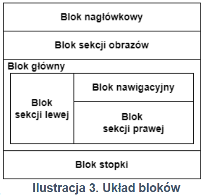

### `<header>`
```html
<header>
  <h1>Nagłówek strony</h1>
  <nav>...</nav>
</header>
```
 
### `<footer>`
```html
<footer>
  <p>Autor strony: 00000000000</p>
</footer>
```
 
### `<main>`
```html
<main>
  <h1>Nagłówek</h1>
  <p>Treść dokumentu</p>
</main>
```
 
### `<nav>`
```html
<nav>
  <ul>
    <li><a href="/">Strona główna</a></li>
    <li><a href="/o-nas">O nas</a></li>
    <li><a href="/kontakt">Kontakt</a></li>
  </ul>
</nav>
```
 
### `<section>`
```html
<section>
  <h2>Sekcja tematyczna</h2>
  <p>Treść powiązana tematycznie</p>
</section>
```
 
### `<article>`
```html
<article>
  <h2>Tytuł artykułu</h2>
  <p>Treść artykułu</p>
</article>
```
 
### `<aside>`
```html
<aside>
  <h3>Sekcja boczna</h3>
  <p>Powiązane linki, dodatkowe informacje.</p>
</aside>
```
 
### `<address>`
```html
<address>
  Jan Kowalski<br>
  ul. Kwiatowa 5<br>
  00-001 Warszawa<br>
  <a href="mailto:jan@email.com">jan@email.com</a>
</address>
```

### Przykład



```html
<!DOCTYPE html>
<html lang="pl">
<head>
    <meta charset="UTF-8">
    <title>Przykład</title>
    <style>
        main{
            display: flex;
        }

        #left{
            width: 30%;
        }

        #right1{
            width: 70%;
            display: flex;
            flex-direction: column;
        }

        #right2{
            flex: 1;
        }
    </style>
</head>
<body>
    <header>
        <!-- Treść bloku nagłówkowego -->
    </header>

    <section id="sekcja_obrazow">
        <!-- Treść sekcji obrazów -->
    </section>

    <main>
        <section id="left">
            <!-- Treść sekcji lewej -->
        </section>

        <div id="right1">
            <nav>
                <!-- Treść bloku nawigacyjnego -->
            </nav>

            <section id="right2">
                <!-- Treść sekcji prawej -->
            </section>
        </div>
    </main>

    <footer>
        <!-- Treść Stopki -->
    </footer>
</body>
</html>
```