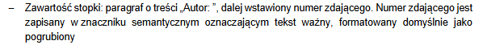

# FORMATOWANIE TEKSTU

### Nagłówki `<h1>` – `<h6>`
```html
<h1>Nagłówek pierwszego stopnia</h1>
<h2>Nagłówek drugiego stopnia</h2>
<h3>Nagłówek trzeciego stopnia</h3>
<h4>Nagłówek czwartego stopnia</h4>
<h5>Nagłówek piątego stopnia</h5>
<h6>Nagłówek szóstego stopnia</h6>
```

Wynik:

```text
NAGŁÓWEK PIERWSZEGO STOPNIA

Nagłówek drugiego stopnia

Nagłówek trzeciego stopnia

Nagłówek czwartego stopnia

Nagłówek piątego stopnia

Nagłówek szóstego stopnia
```

---

### Akapit `<p>`
```html
<p>Pierwszy akapit tekstu.</p>
<p>Drugi akapit tekstu.</p>
```

Wynik:

```text
Pierwszy akapit tekstu.

Drugi akapit tekstu.
```

---

### Pogrubienie `<strong>`

```html
<p>Autor: <strong>12345678901</strong></p>
```
```html
<p>Cena wynosi <strong>99 zł</strong>.</p>
```

Wynik:

```text
Autor: 12345678901
```
> Numer zdającego będzie pogrubiony

```text
Cena wynosi 99 zł.
```
>"99 zł" będzie pogrubione
---

### Kursywa `<em>`
```html
<p>Tytuł książki to <em>Wiedźmin</em>.</p>
```

Wynik:

```text
Tytuł książki to Wiedźmin.
```

>(tekst „Wiedźmin” będzie zapisany kursywą)

---

### Indeks górny `<sup>`
```html
<p>X<sup>2</sup></p>
```

Wynik:

```text
X²
```
---

### Indeks dolny `<sub>`
```html
<p>H<sub>2</sub>O</p>
```

Wynik:
```text
H₂O
```
---
### Łamanie wiersza `<br>`
```html
<p>Pierwsza linia<br>Druga linia<br>Trzecia linia</p>
```

Wynik:

```text
Pierwsza linia
Druga linia
Trzecia linia
```

---

### Odnośnik `<a>`
```html
<a href="https://www.google.com">Przejdź do Google</a>
<a href="kontakt.html">Kontakt</a>
<a href="mailto:jan@example.com">Napisz e-mail</a>
```

Wynik:

```text
Przejdź do Google
Kontakt
Napisz e-mail
```

>- „Przejdź do Google” prowadzi do `https://www.google.com`
>- „Kontakt” prowadzi do podstrony `kontakt.html`
>- „Napisz e-mail” otwiera program pocztowy dla `jan@example.com`

---

### Blok cytatu `<blockquote>`
```html
<blockquote>
    Cytat
</blockquote>
```